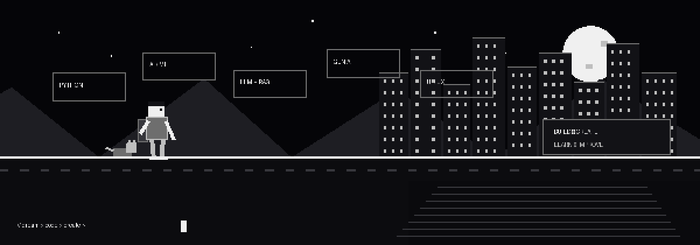

  

# 💫 About Me:
AI/ML Engineer with hands-on project experience across Machine Learning, Deep Learning, and Generative AI, including retrieval-augmented generation (RAG) pipelines, LLM orchestration with LangChain, and computer vision systems built with PyTorch, TensorFlow, and OpenCV. Skilled in Python-based model development, from preprocessing and evaluation through deployment as production-style APIs using FastAPI, Docker, and MLflow. Experienced with Hugging Face, prompt engineering, embeddings, and vector search for building practical LLM applications, with core Python fundamentals reinforced by a data engineering internship in ETL, SQL, and automation.

## 🌐 Socials:
  

# 💻 Tech Stack:
                

# 📊 GitHub Stats:
 
 

---

<!-- Proudly created with GPRM ( https://gprm.itsvg.in ) -->
